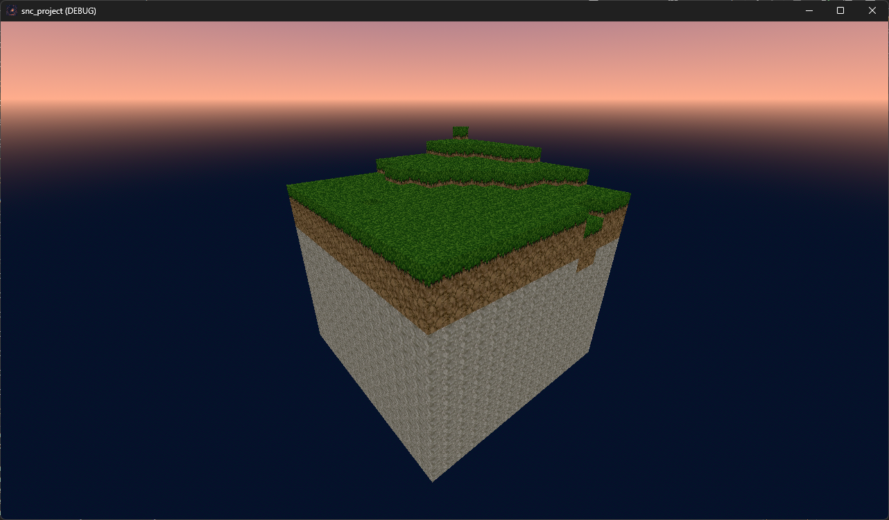

# Steel and Cube

A voxel-based dungeon crawler that combines the immersive first-person RPG elements of Daggerfall with modern voxel-based terrain and construction mechanics. Delve into procedurally generated dungeons, fight enemies, collect loot, and shape the world around you - all while experiencing a classic RPG interface reimagined for the modern era.



## Features

- First-person dungeon crawling with classic RPG elements
- Voxel-based terrain and construction system
- Procedurally generated dungeons with varying themes and difficulty
- Classic RPG interface inspired by Daggerfall!
- Character progression and skill system
- Dynamic lighting and shadow system
- Interactive environment with destructible terrain
- Inventory management with crafting capabilities
- Enemy AI with pathfinding optimized for voxel environments

## Getting Started

### Prerequisites

- Godot 4.0 or later
- 1GB RAM minimum (64GB recommended)
- 500MB available storage

### Installation

1. Clone the repository:
```bash
git clone https://github.com/yourusername/steel-and-cube.git
```

2. Open Godot 4 Engine

3. Click "Import" and navigate to the cloned project directory

4. Select the `project.godot` file

5. Click "Import & Edit"

### Running the Game

1. Open the project in Godot
2. Press F5 or click the "Play" button in the top-right corner
3. Alternatively, export the game for your platform using Godot's export system

## Development Setup

### Project Structure

```
steel-and-cube/
├── assets/
│   ├── textures/
│   ├── models/
│   ├── sounds/
│   └── ui/
├── scenes/
│   ├── main_menu/
│   ├── game_world/
│   └── ui/
├── scripts/
│   ├── world_generation/
│   ├── player/
│   ├── enemies/
│   └── systems/
├── addons/
└── project.godot
```

### Coding Standards

- Follow GDScript style guide
- Use PascalCase for classes and node names
- Use snake_case for functions and variables
- Comment complex algorithms and systems
- Keep functions focused and single-purpose
- Use Godot's built-in signals for communication between nodes

## Contributing

We welcome contributions! Please follow these steps:

1. Fork the repository
2. Create a feature branch (`git checkout -b feature/AmazingFeature`)
3. Commit your changes (`git commit -m 'Add some AmazingFeature'`)
4. Push to the branch (`git push origin feature/AmazingFeature`)
5. Open a Pull Request

### Guidelines for Contributions

- Ensure code follows project style guide
- Add comments for complex logic
- Update documentation if needed
- Test your changes thoroughly
- Keep pull requests focused on single features/fixes

## License

This project is licensed under the MIT License - see the [LICENSE](LICENSE) file for details.

## Acknowledgments

- Inspired by The Elder Scrolls II: Daggerfall
- Older project Voxel Engine Alpaca: https://github.com/Lost-Rabbit-Digital/VoxelEngineAlpaca
- Built with Godot Engine
- Community contributions and feedback

## Contact

- Discord Server: [Join our community](https://discord.gg/Y7caBf7gBj)

## Roadmap

- [ ] Enhanced dungeon generation algorithms
- [ ] Additional enemy types and behaviors
- [ ] Extended crafting system
- [ ] Multiplayer support
- [ ] Mod support
- [ ] Additional biomes and environments