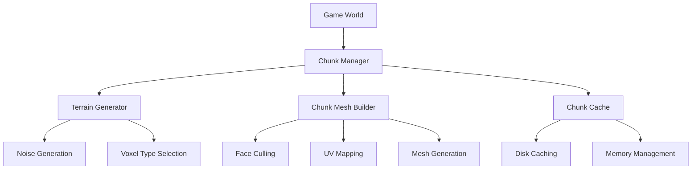
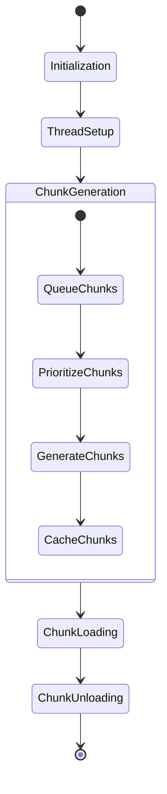
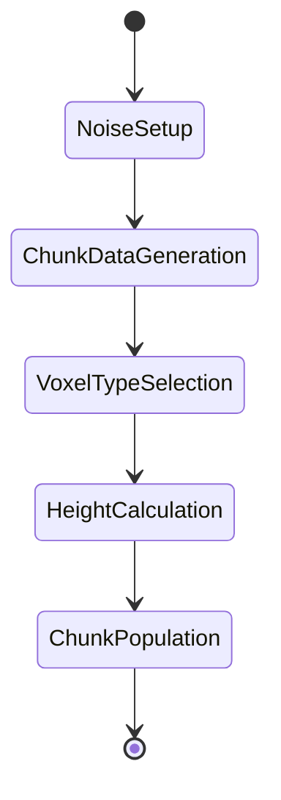
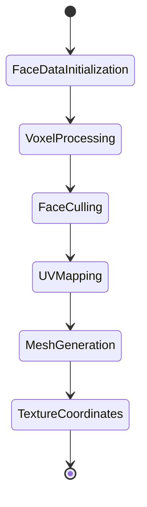

## Project Architecture Overview

1. **Chunk Management**
2. **Terrain Generation**
3. **Mesh Building**
4. **Caching and Optimization**

### Detailed Project Flowchart

## Comprehensive Code Analysis

### 1. Chunk Management (chunk_manager.gd)

#### Key Observations:
- Multithreaded chunk generation
- Intelligent chunk loading/unloading
- Prioritization based on player distance
- Configurable render distances

### 2. Terrain Generation (terrain_generator.gd)

#### Terrain Generation Strategy:
- Uses Perlin noise for terrain generation
- Height-based voxel type selection
- Configurable noise parameters

### 3. Mesh Builder (chunk_mesh_builder.gd)

#### Mesh Generation Techniques:
- Efficient face culling
- Texture atlas support
- Height-based texture selection
- Optimized vertex generation

## Detailed Project Documentation

### Voxel Rendering Pipeline

#### Chunk Generation Flow
1. Player moves or game starts
2. Chunk Manager calculates required chunks
3. Terrain Generator creates chunk data
   - Uses Perlin noise for height
   - Determines voxel types
4. Mesh Builder creates mesh
   - Culls hidden faces
   - Applies texture coordinates
5. Chunk cached and added to world

#### Memory and Performance Considerations
- Chunks are generated in threads
- Least recently used chunks are unloaded
- Mesh generation is batched
- Texture atlas minimizes draw calls

### Technical Challenges and Solutions

1. **Face Culling**
   - Check neighboring voxels before rendering faces
   - Reduces vertex count significantly

2. **Texture Mapping**
   - Single texture atlas
   - UV coordinates calculated dynamically
   - Height and block type determine texture

3. **Multithreading**
   - Separate threads for chunk generation
   - Mutex-protected shared resources
   - Semaphore-based thread synchronization
