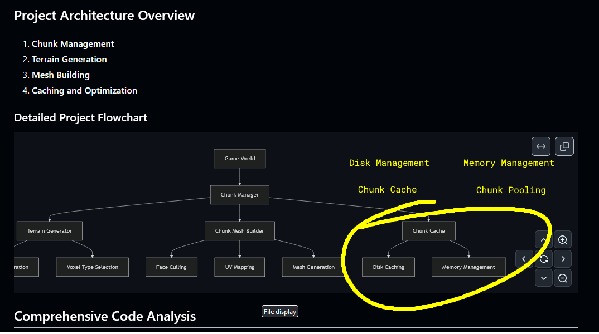

# Tasks

## Optimisations
### Chunk Pooling
| Aspect | Current Implementation | Proposed Improvement |
|--------|------------------------|----------------------|
| Disk Caching | Basic file-based caching | ✓ Already good implementation |
| RAM Pooling | Minimal management | + Explicit chunk pooling |
| Memory Limit | Implicit | + Configurable pool size |
| Chunk Reuse | No explicit reuse | + Efficient chunk recycling |

## Project Architecture
### Optimized Chunk Management

The current architecture can be improved by adopting a more structured approach to disk caching and in-memory chunk pooling. 

By splitting the disk caching and in-memory pooling into separate, well-defined systems, the project architecture will become more modular, maintainable, and efficient.

1. **Disk-based Chunk Caching**
   - Implement a dedicated `ChunkCache` system to handle serializing and deserializing chunks to/from disk
   - Utilize a configurable cache directory and enforce a maximum number of cached chunks to prevent unbounded disk usage

2. **RAM-based Chunk Pooling**
   - Create a `ChunkPool` class to manage a reusable pool of `ChunkData` objects in memory
   - Implement efficient checkout and return methods to minimize allocation overhead
   - Allow configuring the maximum pool size based on available RAM

3. **Integrate Caching and Pooling**
   - Modify the `ChunkManager` to utilize the `ChunkCache` and `ChunkPool` for all chunk-related operations
   - Ensure a clear lifecycle management for chunks, including saving to cache before unloading

